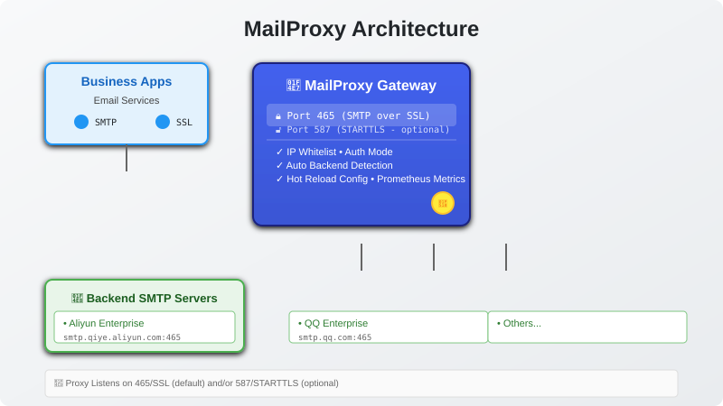

# MailProxy

<div align="center">

**SMTP 邮件代理网关** - 统一接入面，多后端灵活路由

[](LICENSE)
[](https://go.dev/)
[](README.md)

</div>

## 🎯 解决什么问题

内部业务程序需要对接多个企业邮箱服务商 (阿里、腾讯等),但各家 SMTP 要求不同、认证复杂。MailProxy 提供**统一的 SMTP 接口**:

```
┌─────────────┐              ┌─────────────┐
│ Business    │  Simple      │ MailProxy   │  Smart routing & backend management
│ Applications │  standard   │ Gateway     │  → Multiple backends
│ Email APIs  │←────────────→│             │
└─────────────┘  SMTP       └─────────────┘
                    over SSL                     ↓
                             Multi-backend pool                        ┌──────────┐
                                                                       │ Aliyun   │
                                                                       │ QQ ...   │
                                                                       └──────────┘
```

**收益:**
- ✅ 业务代码**零改造**,只需改 SMTP 地址和端口
- ✅ **隐藏后端复杂性**:支持多套邮箱账号配置与动态路由
- ✅ **安全隔离**:IP 白名单、认证控制、证书体系完整管理
- ✅ **灵活扩展**:新增后端无需修改业务程序

---

## ⚡ 快速开始

### 1️⃣ 本地测试

```bash
# 生成自签名证书 (仅供开发环境使用)
./deploy/gen-cert.sh

# 准备配置
cp config.example.yaml config.yaml
chmod 600 config.yaml
vim config.yaml  # 填入后端邮箱账号信息

# 启动服务
./mailproxy -config config.yaml
```

### 2️⃣ 业务程序接入

只需修改 SMTP 连接参数:

| 参数 | 值 |
|------|-----|
| **主机** | `你的服务器 IP:465` |
| **协议** | SMTP over SSL (隐式 TLS) |
| **认证** | PLAIN 或 LOGIN 模式 |

<details>
<summary><b>📊 架构概览</b></summary>

<div align="center">
  


</div>

</details>

<details>
<summary><b>📋 业务程序配置速查表</b></summary>

<div align="center">
  


</div>

</details>

---

## ✨ 核心特性

### 🔐 安全与控制

- **IP 白名单访问控制** - 支持 CIDR 网段，防止开放中继滥用
- **双重认证模式** - 可选免鉴权 (`none`) 或代理侧登录 (`auth`)
- **TLS 证书灵活管理** - 自有 CA 签发或公共 CA 信任，支持热更新
- **信封发件人改写** - 适配强一致性要求的后端 (如企业邮箱)

### 🚀 性能与可靠性

- **双监听模式共存** - 465(SMTP over SSL) + 587(STARTTLS),满足不同客户端需求
- **启动前健康检查** - 自动检测后端连通性与认证有效性
- **优雅关闭** - SIGTERM 信号处理，等待现有连接完成
- **超时控制** - TLS 握手、IO 读写、后端转发全链路超时保护

### 🛠️ 可运维性

- **配置热加载** - SIGHUP 触发，无需重启即可生效
- **结构化日志** - 控制台 + 文件双输出，每次发信记录来源/目标/耗时
- **Prometheus 指标** - 发送总数、后端错误数、活跃连接数监控
- **系统托管** - systemd 封装，非 root 用户运行，Capability 降权

### 🌐 兼容性

- **标准 SMTP 协议** - EHLO/HELO, AUTH, MAIL FROM, RCPT TO, DATA, QUIT
- **STARTTLS 兼容** - 为 Veeam Backup & Replication 等仅支持 STARTTLS 的客户端优化
- **自动路由** - 按发件人地址精确匹配后端配置，或固定账号绑定

---

## 🏗️ 部署指南

### 方式一：手工部署

```bash
# 1. 安装二进制
install -m 755 mailproxy /usr/local/bin/mailproxy

# 2. 创建目录和配置文件
install -d /etc/mailproxy
install -m 600 config.yaml /etc/mailproxy/config.yaml

# 3. 安装 systemd 服务单元
install -m 644 deploy/mailproxy.service /etc/systemd/system/
systemctl daemon-reload
systemctl enable --now mailproxy
```

### 方式二：RPM 包部署 (RHEL/CentOS/Rocky)

**构建** (macOS 本机即可):

```bash
bash deploy/build-rpm.sh
# 产物：dist/mailproxy-1.0.3-1.el*.x86_64.rpm
```

**安装** (目标服务器):

```bash
rpm -ivh mailproxy-1.0.3-1.el9.x86_64.rpm
# 自动完成:
#   • 创建 mailproxy 系统用户 (nologin)
#   • 生成自签名证书到 /etc/mailproxy/certs/
#   • 安装配置文件与 systemd unit
#   • 设置开机自启 (但不启动)

vim /etc/mailproxy/config.yaml      # 配置后端邮箱账号
systemctl start mailproxy           # 手动启动
```

**升级**:

```bash
rpm -Uvh mailproxy-<new>.rpm        # 已修改的 config.yaml 保留为 .rpmnew
```

---

## 📖 配置详解

### 1. 基础配置示例

```yaml
server:
  listen: ":465"                      # SMTP over SSL
  # starttls_listen: ":587"          # 可选启用 STARTTLS
  hostname: mailproxy.internal
  max_connections: 100                # 并发上限
  ip_whitelist:                       # 只允许内网访问
    - 127.0.0.1
    - 10.0.0.0/8
    - 192.168.0.0/16

backends:
  - id: aliyun                        # 后端唯一标识
    name: "阿里企业邮箱"
    host: smtp.qiye.aliyun.com
    port: 465
    security: ssl                     # ssl | starttls
    username: sender@example.com
    password: "your-app-password"
    rewrite_from: false               # 信封发件人改写开关
```

### 2. 认证模式切换

#### 模式 A: 免鉴权 (`mode: none`)

适合**可信内网环境**,所有流量使用固定后端:

```yaml
auth:
  mode: none                          # 不验证客户端身份
  default_backend: aliyun             # 固定使用该后端
```

**特点:**
- 客户端无需填写账号密码
- 即使发送 AUTH 命令也会被忽略
- 适合内部受信任应用

#### 模式 B: 代理登录 (`mode: auth`)

需要客户端提供账号密码，支持多租户路由:

```yaml
auth:
  mode: auth                          # 开启登录认证
  
accounts:
  - username: biz-app-1
    password: change-me
    backend: aliyun                   # 固定绑定某个后端
    
routes:                               # 按发件人地址路由
  - from: "noreply@example.com"
    backend: tencent
```

**特点:**
- 客户端必须认证才能发送邮件
- 支持按账号或发件人地址智能路由
- 未匹配时返回 550 错误

---

## 🔧 运维管理

### 配置热重载

```bash
kill -HUP $(pidof mailproxy)
# 或 systemd: systemctl reload mailproxy
```

**即时生效:**
- ✅ 后端账号配置变更
- ✅ 代理账号与密码修改
- ✅ IP 白名单调整
- ✅ 路由规则更新

**需重启生效:**
- ❌ 监听地址变化
- ❌ TLS 证书更换

### 启动校验

```yaml
validate_on_start: true    # 启动时检测所有后端连通性
```

失败则中止启动并输出详细错误信息。

### Prometheus 监控

```yaml
metrics:
  enabled: true
  listen: 127.0.0.1:9465   # 仅本地暴露
```

**指标项:**
- `mailproxy_send_total` - 累计发送数量 (label: status)
- `mailproxy_backend_error_total` - 后端错误计数 (label: backend)
- `mailproxy_active_connections` - 当前活跃连接数

---

## 📜 SSL 证书配置

### 场景 1: 替换为企业 CA 证书

1. **申请证书** - SAN 包含实际域名或 IP
2. **拼接证书链** (如使用中间 CA):

   ```bash
   cat server.crt intermediate.crt > fullchain.crt
   cp fullchain.crt /etc/mailproxy/certs/server.crt
   ```

3. **设置权限**:

   ```bash
   chmod 644 /etc/mailproxy/certs/server.crt
   chmod 600 /etc/mailproxy/certs/server.key
   chown root:mailproxy /etc/mailproxy/certs/server.*
   ```

4. **重启服务**:

   ```bash
   systemctl restart mailproxy
   ```

### 场景 2: 导入自建 CA 到业务平台

Java 示例:

```bash
keytool -importcert -alias mailproxy \
  -file /etc/mailproxy/certs/server.crt \
  -kestore $APP_HOME/jre/lib/security/cacerts \
  -storepass changeit
```

**推荐使用 CA 证书的原因:**
- 一次导入根 CA，后续轮换无需再改业务平台
- 避免每换证书就需重新配置

---

## 🧪 测试验证

### 1. 本地连通性测试

```bash
# 验证 TLS 握手
openssl s_client -connect 127.0.0.1:465 -quiet

# STARTTLS 测试
openssl s_client -starttls smtp -connect 127.0.0.1:587 -quiet

# 发送测试邮件
go run ./testtools/sendmail \
  -addr 127.0.0.1:10465 \
  -from sender@example.com -to recipient@example.com
```

### 2. 单元测试

```bash
go test ./... -v
```

覆盖场景:
- 配置加载与校验
- 路由解析逻辑
- IP 白名单匹配
- STARTTLS 升级流程
- 双监听共存
- 后端故障透传
- 信封发件人改写

---

## 🔄 设计约束与演进

### 当前版本限制

- ❌ 无邮件队列系统 - 直接转发，失败即返回
- ❌ 无本地重试 - 依赖业务侧重试机制
- ❌ 无 Web UI - 纯文件配置

### 未来迭代规划

- [ ] 邮件队列与持久化存储
- [ ] 限流控制 (单客户端/单账号/单 IP)
- [ ] TLS 证书自动更新 (ACME)
- [ ] HTTP 健康检查端点
- [ ] 黑名单过滤与 SPF/DKIM 验证
- [ ] RESTful API 管理界面

---

## 🛠️ 编译与交叉编译

### macOS 原生编译

```bash
go build -o mailproxy .
```

### Linux 交叉编译

```bash
GOOS=linux GOARCH=amd64 go build -o mailproxy .
```

### RPM 打包构建 (macOS 也可)

```bash
bash deploy/build-rpm.sh
```

---

## 📄 附录

### 常见后端配置清单

| 服务商 | Host | Port | Security | 备注 |
|--------|------|------|----------|------|
| 阿里企业邮箱 | smtp.qiye.aliyun.com | 465 | ssl | 需授权码 |
| 腾讯企业邮箱 | smtp.exmail.qq.com | 465 | ssl | 需授权码 |
| Gmail | smtp.gmail.com | 465 | ssl | OAuth2 或应用专用密码 |

### 命令行参数

```bash
./mailproxy -help
Usage: mailproxy [-config CONFIG] [-log LOGFILE]

Flags:
  -config string  配置文件路径 (default "config.yaml")
  -log string     日志文件路径 (覆盖 log.file)
```

---

## 📮 问题反馈与贡献

欢迎提交 Issue 与 PR! 本项目采用 MIT License。

---

<div align="center">

Made with ❤️ using Go SMTP library

</div>
